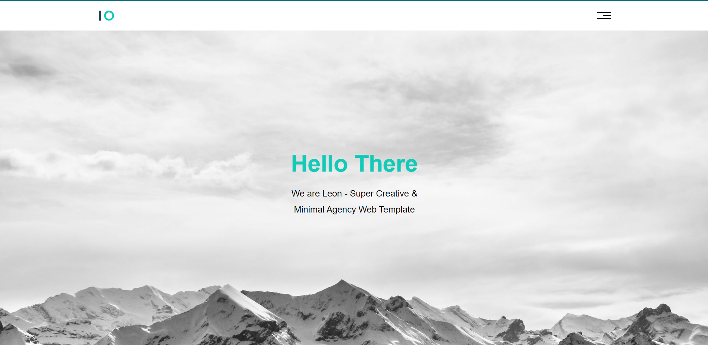

# Leon Agency Web Template

</img>

## Try it Live!

Check out the live app [Leon](https://leon-template-beta.vercel.app/)

## Tools Used

-   HTML
-   CSS

## Getting Started

1. Clone this repository.

    ```bash
    git clone https://github.com/mahmoud-mohsen-dev/leon-template.git
    ```

2. Navigate to the Project Directory:

    ```bash
    cd leon-template
    ```

3. Development Server

    Run the project with Live server

    or just open `index.html` file on the browser

_This poject was part of El Zero Web School Courses_
